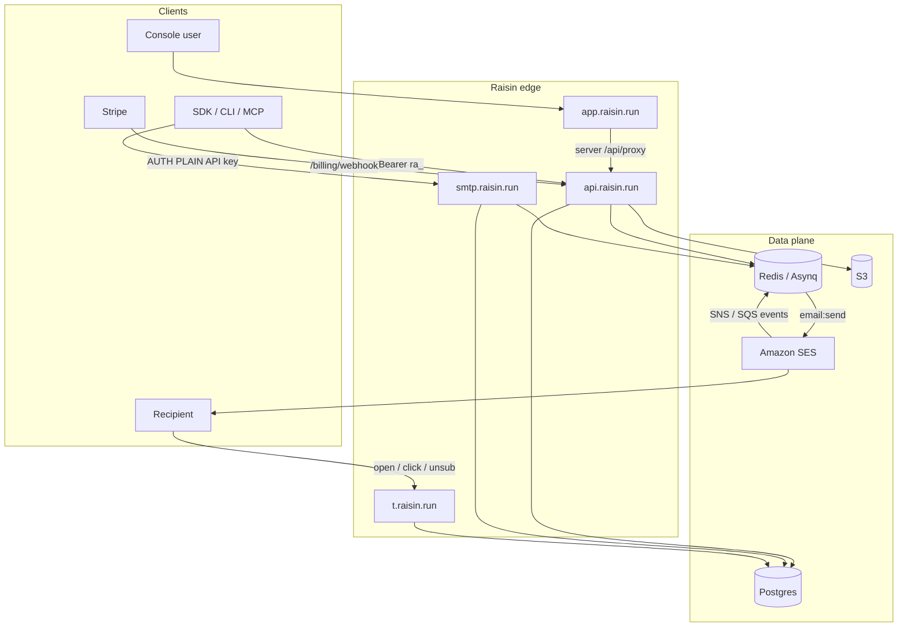
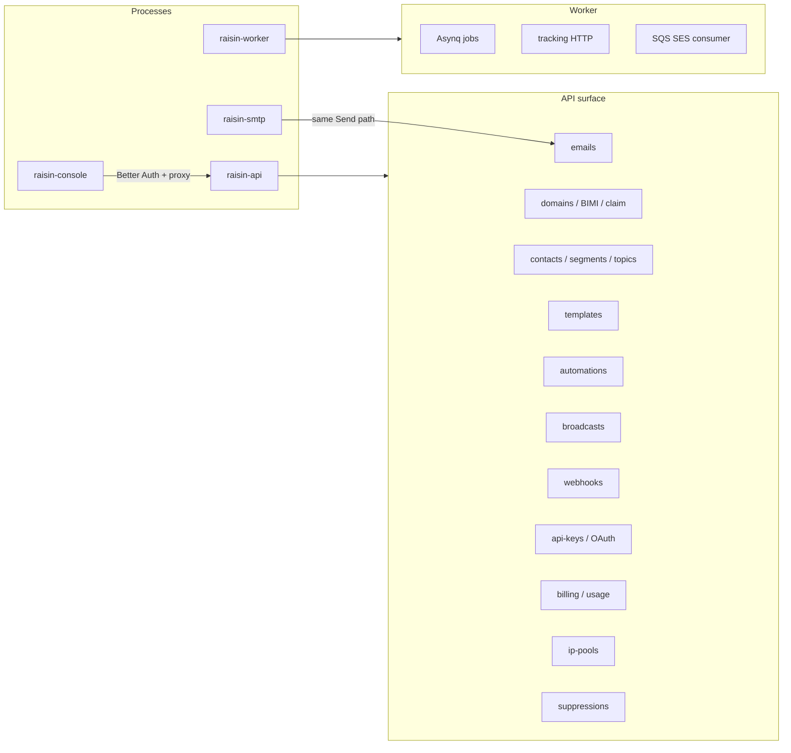
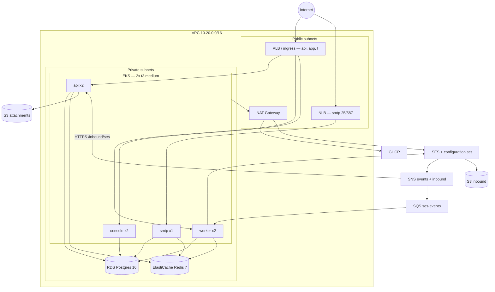
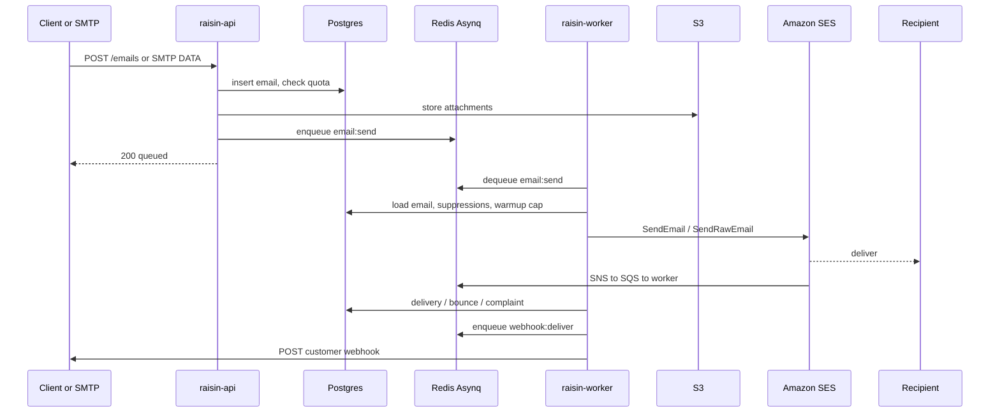
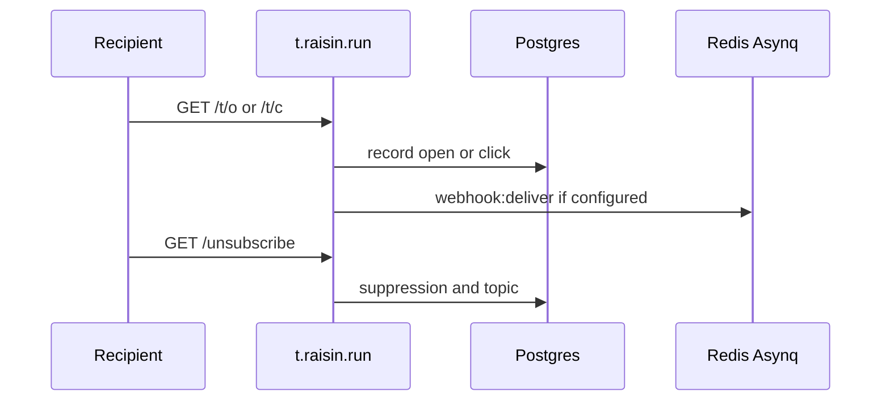
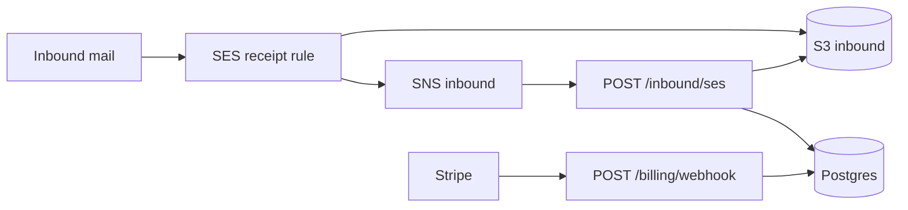

# Architecture

Raisin is a developer email API: four processes, Postgres, Redis, and Amazon SES. This page is the system as the repo implements it today — not the cheaper launch target (see [Scaling](./scaling.md)).

## Hosts

| Host | Process | Role |
|------|---------|------|
| `api.raisin.run` | `raisin-api` | Public REST API |
| `app.raisin.run` | `raisin-console` | Next.js console + Better Auth |
| `t.raisin.run` | `raisin-worker` | Open / click / unsubscribe HTTP |
| `smtp.raisin.run` | `raisin-smtp` | SMTP relay (`:25` / `:587`) |

Local compose remaps API `18080`, worker `18081`, SMTP `2525`, Postgres `5433`.

## System context

The console never calls the API from the browser with a team key. Dashboard traffic goes through Next.js `/api/proxy/*` so the API origin stays server-side.

## Processes and domains

Four deployables. Everything else is a package behind `raisin-api` or a job on `raisin-worker`.

### API

Go / chi. Auth is `Authorization: Bearer ra_…` plus a `User-Agent`. Rate-limit headers on authenticated responses.

Unauthenticated: `/health`, `/docs`, `/openapi.yaml`, `/console/token`, `/console/provision`, `/inbound/ses`, `/billing/webhook`, `/oauth/token`.

### Worker

One process, three jobs:

1. **Asynq server** — `email:send` (critical), `broadcast:send`, `webhook:deliver`, `domain:verify`, `automation:step`, `ip:warmup-tick` (low). Default concurrency **20**.
2. **Tracking HTTP** — `/t/o/`, `/t/c/`, `/unsubscribe/`.
3. **SQS consumer** — SES events when `SQS_EVENTS_QUEUE_URL` is set.

A daily Asynq scheduler ticks dedicated-IP warmup at midnight UTC.

### SMTP

AUTH PLAIN; API key is the password. Parses a simple MIME body and calls the same `email.Service.Send` as `POST /emails`.

### Console

Next.js. Landing is currently `/` in this app. Better Auth uses the same Postgres as the API (`002_better_auth.sql`).

## Current AWS deploy

What `deploy/terraform` and `deploy/helm/raisin` create if you apply defaults. Images come from GHCR, not ECR.

Defaults: EKS **1.31**, **2× t3.medium**, RDS **db.t4g.medium** (50 GB gp3, single-AZ), ElastiCache **cache.t4g.small**, **1 NAT**, Helm replicas **2 / 2 / 1 / 2** (api / worker / smtp / console).

Terraform provisions VPC, EKS, RDS, Redis, S3, SES/SNS/SQS, and the IRSA role. It does **not** provision the ALB, nginx ingress, or SMTP NLB — those appear when you install ingress + the Helm `LoadBalancer` service. Pin a Kubernetes version still in EKS standard support (1.31 is extended as of 2026 and bills 6×).

IAM on the app role: S3 attachments/inbound, SQS receive, SES send + identities + dedicated IP APIs.

## Send path

API and SMTP only enqueue. SES send happens on the worker.

Idempotency: `Idempotency-Key` on send. Webhooks: `Raisin-Signature: t=<unix>,v1=<hex>` over `${t}.${rawBody}`.

## Tracking

Same worker process as Asynq. `TRACKING_BASE_URL` (prod: `https://t.raisin.run`) is rewritten into outbound HTML.

## Inbound and billing

Receipt rule stores raw MIME on S3, then SNS hits the API (no API key). Stripe updates plan/quota on the same team row the send path checks.

## Local vs prod

| Concern | Local | Prod |
|---------|-------|------|
| Send | Mailpit (`SENDER_DRIVER=mailpit`) | SES v2 |
| AWS APIs | LocalStack (S3, SQS, SNS, SES) | Real AWS via IRSA |
| Attachments | `STORAGE_DRIVER=local` | S3 |
| Domain verify | Stub — marks verified | Polls SES DKIM / identity |
| Events | Worker send-path + `/test/events/` | SNS → SQS → worker |

Compose applies `001_init.sql`, `002_better_auth.sql`, `003_platform_extras.sql` on first boot.
