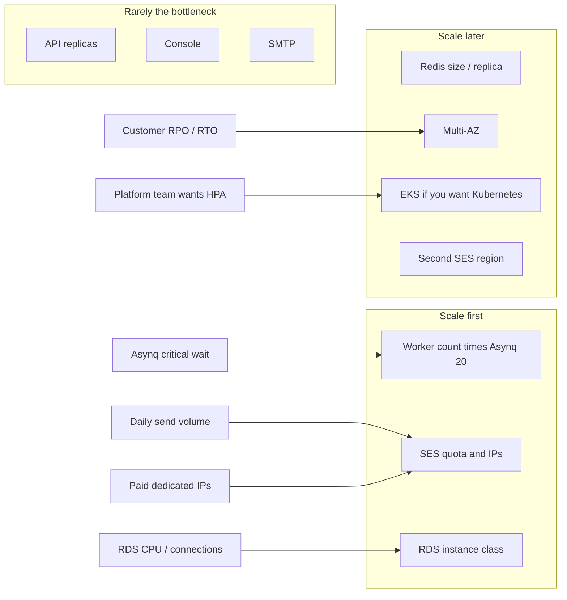
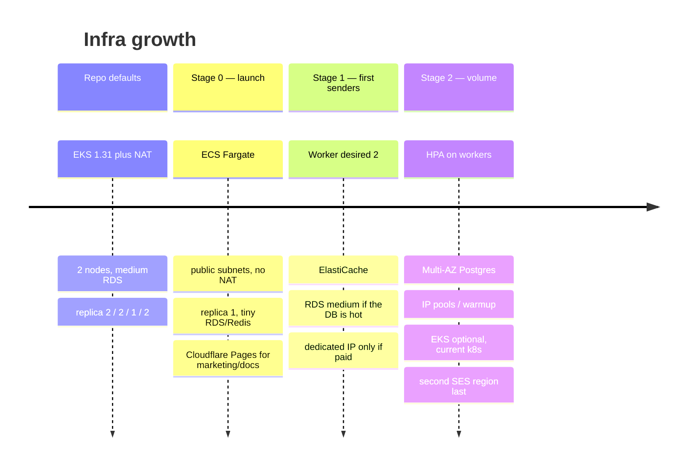
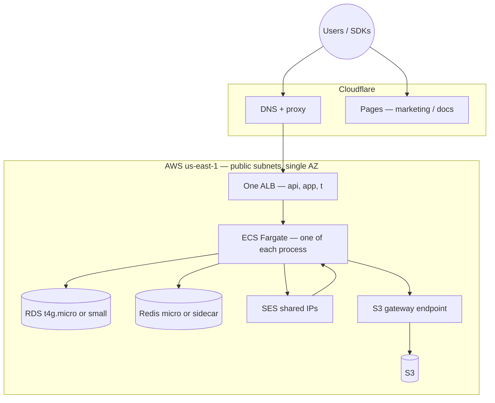
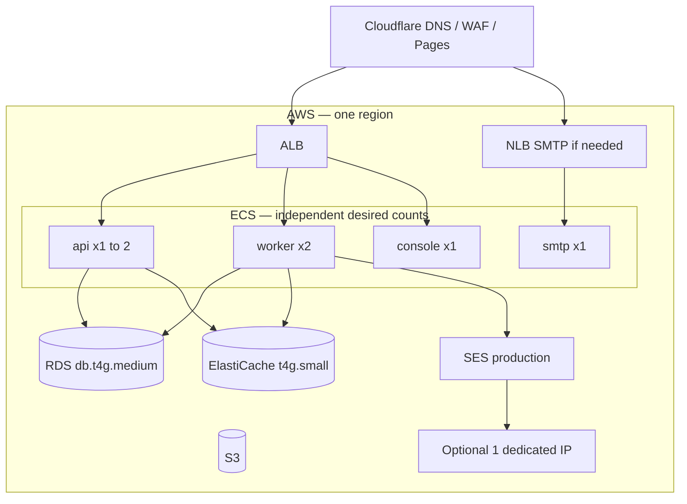
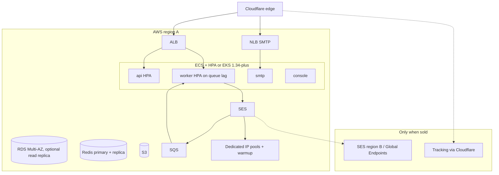

# Scaling

The four processes, Postgres, Redis, SES, S3, and SQS stay. What changes is replica count, instance class, and whether you pay for EKS, NAT, and Multi-AZ.

Today’s Terraform/Helm defaults are a **prod-shaped** cluster (see [Architecture](./architecture.md)). This page is how to start small and grow without redesigning the product.

## What actually scales

The send path does not change between stages: API/SMTP enqueue, workers drain, SES delivers.

## Growth

Cost ballpark, `us-east-1` on-demand, before SES volume: stage 0 **~$40–90**, stage 1 **~$150–250**, repo defaults **~$320–380** (or **~$700** if EKS 1.31 stays on extended support). SES is **$0.10 / 1,000** outbound à la carte; a standard dedicated IP is **$24.95 / month**.

---

## Stage 0 — launch

Same images. No EKS, no NAT, one of each process. Marketing and docs on Cloudflare.

| Choice | Why |
|--------|-----|
| ECS Fargate (or one small EC2) | Avoid the EKS control-plane fee |
| Public subnets + security groups | Skip NAT (~$37 + per-GB) |
| S3 gateway VPC endpoint | Free; attachments never hairpin the internet |
| `db.t4g.micro` / `small`, 20 GB | Single-AZ is fine until you sell an SLA |
| Redis sidecar until the queue matters | ElastiCache can wait |
| SMTP on 587 on the same task | Add an NLB when someone actually relays |
| Cloudflare Pages | Keep marketing/docs off the cluster |
| SES à la carte, one region | No dedicated IPs, no Global Endpoints |

Helm `replicaCount` should be **1** everywhere. Two empty console pods do not buy availability.

Suggested Terraform flags (not in the repo yet): `enable_eks=false`, `enable_nat=false`, `enable_multi_az=false`. One module set, a `small` tfvars — not a second architecture.

---

## Stage 1 — first paying senders

Triggers: SES production access, sustained send, or you care about a few minutes of DB downtime.

Scale **workers** first (Asynq `critical` wait). Leave API at 1 until p95 says otherwise. Add a dedicated IP only when a tenant pays for it.

Optional: ECS Service Auto Scaling on worker CPU or Asynq queue depth.

---

## Stage 2 — real volume

EKS is optional packaging. The data plane does not move.

If you adopt EKS, pin a version in **standard** support. Do not ship the current `kubernetes_version = "1.31"` default. Keep one NAT plus S3 (and ECR, if you leave GHCR) gateway endpoints.

Second region is SES identities and maybe tracking first. Do not clone the VPC until failover is a sold feature.

---

## Triggers

| Signal | Action |
|--------|--------|
| SES sandbox / 200 per day | Request production access — not more servers |
| Asynq `critical` wait more than a few seconds | +1 worker task |
| RDS CPU over ~60% or connection saturation | Next instance class |
| Redis memory over ~70% | Next cache node |
| API p95 over ~300 ms under load | +1 API replica |
| Customer buys dedicated IP | SES IP pool, not a new cluster |
| Need RPO / RTO | RDS Multi-AZ, then backups to a second region |
| Need Kubernetes workflows | EKS, current version, still one NAT until HA is required |

## Terraform knobs

One module set, three tfvars — `small` | `prod` | `ha`:

| Knob | small | prod | ha |
|------|-------|------|----|
| Compute | ECS, desired 1 | ECS, workers 2 | EKS or ECS + HPA |
| RDS | `db.t4g.micro` | `db.t4g.medium` | Multi-AZ + larger |
| Redis | micro or sidecar | `cache.t4g.small` | replica |
| NAT | none (public) | 1 NAT + S3 endpoint | NAT per AZ |
| Load balancers | 1 ALB; SMTP on 587 | ALB + NLB | same + WAF |
| SES IPs | 0 | 0–1 paid | pools |

## Do not do early

- EKS on day one
- `replicaCount: 2` on every chart
- NAT + private subnets before there is a compliance reason
- Dedicated IPs or Global Endpoints before a tenant pays
- A full staging clone of prod — one small env, or pause Fargate/RDS overnight
- Multi-region app topology — SES can go multi-region later; the API does not need to
